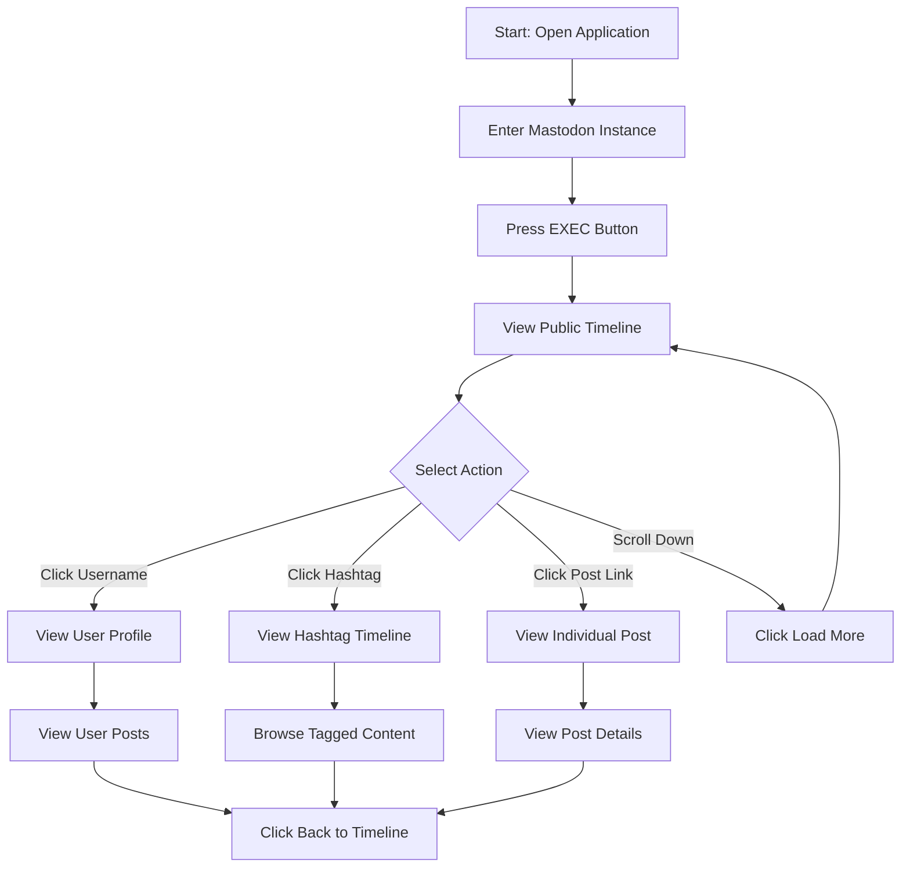
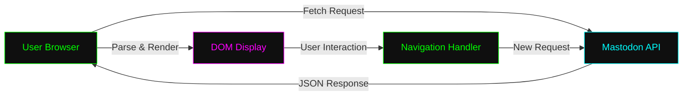

# xsukax Mastodon Browser

A lightweight, privacy-focused web application for browsing Mastodon public timelines, user profiles, hashtags, and individual posts across the Fediverse without requiring authentication or account registration.

**Demo**: [https://xsukax.github.io/xsukax-Mastodon-Browser](https://xsukax.github.io/xsukax-Mastodon-Browser)

**My Profile Demo**: [https://xsukax.github.io/xsukax-Mastodon-Browser/?instance=infosec.exchange&user=xsukax](https://xsukax.github.io/xsukax-Mastodon-Browser/?instance=infosec.exchange&user=xsukax)

**Post Demo**: [https://xsukax.github.io/xsukax-Mastodon-Browser/?instance=infosec.exchange&user=xsukax&post=115641199928970697](https://xsukax.github.io/xsukax-Mastodon-Browser/?instance=infosec.exchange&user=xsukax&post=115641199928970697)

**HashTag Demo**: [https://xsukax.github.io/xsukax-Mastodon-Browser/?instance=infosec.exchange&tag=xsukax](https://xsukax.github.io/xsukax-Mastodon-Browser/?instance=infosec.exchange&tag=xsukax)

## Project Overview

xsukax Mastodon Browser is a client-side web application designed to provide anonymous, read-only access to public content from any Mastodon instance. Built as a single HTML file with embedded JavaScript and CSS, this browser enables users to explore the federated social network ecosystem without creating accounts, logging in, or installing native applications.

The application leverages Mastodon's public API endpoints to fetch and display public timelines, user profiles with post history, hashtag-based content streams, and individual post threads. All API interactions occur directly from the user's browser to the selected Mastodon instance, ensuring no intermediary servers process or store user data.

### Primary Functionalities

- **Public Timeline Browsing**: View the federated public timeline from any Mastodon instance
- **User Profile Exploration**: Access user profiles, biographical information, statistics, and post history
- **Hashtag Discovery**: Browse posts associated with specific hashtags across instances
- **Individual Post Viewing**: Direct access to specific posts with full context and metadata
- **Cross-Instance Navigation**: Seamlessly follow links to users and content across different Mastodon servers
- **URL Parameter Support**: Share direct links to specific instances, users, posts, or hashtags

## Security and Privacy Benefits

xsukax Mastodon Browser implements several architectural decisions that prioritize user privacy and security:

### Zero Authentication Required
The application exclusively accesses public API endpoints that do not require authentication tokens, API keys, or user credentials. Users can browse content without creating accounts or providing personal information to any service.

### Client-Side Architecture
All code execution occurs entirely within the user's web browser. There are no backend servers, databases, or intermediary services that could log, track, or store user browsing behavior. The application consists of a single static HTML file that can be inspected, audited, and verified by users with technical expertise.

### Direct API Communication
API requests are made directly from the user's browser to the selected Mastodon instance using native browser fetch APIs. No third-party analytics, tracking scripts, or external dependencies are loaded beyond the Tailwind CSS framework (delivered via CDN) and Google Fonts for typography.

### No Data Persistence
The application does not use localStorage, sessionStorage, cookies, or any other browser storage mechanisms. No browsing history, preferences, or user data is stored between sessions. Each page load represents a fresh start with no retained information.

### Content Security
All external links open in new tabs with `noopener noreferrer` attributes to prevent potential security vulnerabilities. User-generated content is properly escaped to prevent XSS attacks, and HTML parsing is performed using safe DOM manipulation methods.

### Transparent Operation
The entire application source code is visible and auditable within the single index.html file. Users can review exactly what code executes in their browser, verify API endpoints being accessed, and confirm no hidden functionality exists.

## Features and Advantages

### Lightweight and Fast
- **Single-file architecture**: No complex build processes, dependencies, or installation requirements
- **Minimal footprint**: Entire application delivered in one HTML file under 50KB
- **Optimized rendering**: Efficient DOM manipulation with document fragments for smooth scrolling
- **Lazy loading**: Images and media load on-demand to reduce bandwidth consumption

### Privacy-Centric Design
- **No tracking or analytics**: Zero telemetry, metrics collection, or user behavior monitoring
- **No accounts required**: Browse content without authentication or registration
- **No data retention**: Application maintains no session history or stored preferences
- **Portable and self-hosted**: Can be downloaded and run locally without internet connectivity for Mastodon instances

### User Experience
- **Retro terminal aesthetic**: Distinctive monospace font with green-on-black color scheme inspired by classic CRT terminals
- **Responsive interface**: Adapts to desktop, tablet, and mobile screen sizes
- **Keyboard-friendly**: Enter key submits instance queries for efficient navigation
- **Instance suggestions**: Pre-populated dropdown with popular Mastodon instances
- **URL sharing**: Generated URLs allow direct linking to specific profiles, posts, and hashtags

### Fediverse-Native Features
- **Cross-instance support**: Browse content from any publicly accessible Mastodon instance
- **Federated navigation**: Follow users and hashtags across different servers seamlessly
- **Boost and reply context**: View reblog attribution and engagement statistics
- **Custom emoji rendering**: Displays instance-specific custom emojis inline
- **Rich media support**: Preview images with click-to-enlarge functionality
- **Visibility indicators**: Shows post visibility levels (public, unlisted, followers-only)

### Developer-Friendly
- **Open source**: Fully transparent codebase available for inspection and modification
- **No compilation required**: Pure HTML/CSS/JavaScript with no build step
- **Easy deployment**: Host on any static file server (GitHub Pages, Netlify, etc.)
- **Clean code structure**: Well-organized JavaScript class with clear separation of concerns

## Installation Instructions

### Option 1: Use the Online Demo
No installation required. Visit the live demo at [https://xsukax.github.io/xsukax-Mastodon-Browser](https://xsukax.github.io/xsukax-Mastodon-Browser) and start browsing immediately.

### Option 2: Download and Run Locally
1. Download the `index.html` file from the GitHub repository
2. Save the file to your local system
3. Open the file directly in any modern web browser (Chrome, Firefox, Safari, Edge)
4. No web server required for basic functionality

### Option 3: Host on Your Own Server
1. Clone the repository:
   ```bash
   git clone https://github.com/xsukax/xsukax-Mastodon-Browser.git
   cd xsukax-Mastodon-Browser
   ```

2. Deploy the `index.html` file to your web server or static hosting service

3. No server-side configuration required (pure static file hosting)

### Option 4: Deploy to GitHub Pages
1. Fork the repository on GitHub
2. Navigate to repository Settings → Pages
3. Select the main branch as the source
4. Your instance will be available at `https://[username].github.io/xsukax-Mastodon-Browser`

### Browser Requirements
- Modern web browser with ES6+ JavaScript support
- Enabled JavaScript (application is fully client-side)
- Internet connectivity to access Mastodon instance APIs
- No browser extensions or plugins required

### Server Configuration (Optional)

If hosting on a web server, ensure the following:

#### Apache (.htaccess)
No special configuration required. Standard static file serving is sufficient.

#### Nginx
```nginx
location / {
    try_files $uri $uri/ /index.html;
}
```

#### PHP Configuration (php.ini)
Not applicable. This application does not use PHP or any server-side processing. It is a pure client-side HTML/JavaScript application that requires only static file hosting.

## Usage Guide

### Basic Navigation Workflow



### Step-by-Step Usage Instructions

#### 1. Connecting to a Mastodon Instance
- **Method A**: Select a popular instance from the dropdown menu (e.g., mastodon.social, fosstodon.org)
- **Method B**: Type a custom instance domain in the input field (e.g., techhub.social)
- Press the **EXEC** button or hit **Enter** to load the public timeline
- The application will fetch and display the most recent public posts

#### 2. Browsing the Public Timeline
- Scroll through the chronological feed of public posts
- Each post displays:
  - User avatar and display name
  - Username and instance (e.g., @user@instance.social)
  - Post content with formatted links, mentions, and hashtags
  - Media attachments (images with preview)
  - Engagement statistics (replies, boosts, favorites)
  - Relative timestamp (e.g., 2h, 3d, or specific date)
- Click **LOAD_MORE** at the bottom to fetch older posts

#### 3. Exploring User Profiles
- Click any username, display name, or avatar to view their profile
- Profile view includes:
  - Avatar and display name with custom emojis
  - Full handle (username@instance)
  - Biography with formatted links
  - Statistics (total posts, following count, followers count)
  - Custom profile fields
  - Account creation date
  - Recent posts from the user
- Click **LOAD_MORE** to view older posts from the user
- Use the **< BACK** button to return to the previous view

#### 4. Following Hashtags
- Click any hashtag (displayed in magenta/purple) to view all posts with that tag
- The hashtag timeline displays posts from the selected instance
- Navigate between posts or return to the main timeline

#### 5. Viewing Individual Posts
- Click the **> open** link on any post to view it in detail
- Individual post view shows:
  - Full post content and metadata
  - Larger avatar and profile information
  - Complete engagement statistics
  - Post timestamp and unique ID
  - Direct link to view on the original instance

#### 6. Cross-Instance Navigation
- The application automatically switches instances when following users or hashtags from different servers
- The instance input field updates to reflect the current instance being browsed
- All URLs are shareable and bookmark-friendly

### URL Parameter Reference

You can construct direct links using URL parameters:

| Parameter | Description | Example |
|-----------|-------------|---------|
| `instance` | Mastodon instance domain | `?instance=mastodon.social` |
| `user` | Username to view | `?instance=mastodon.social&user=gargron` |
| `post` | Specific post ID | `?instance=mastodon.social&user=gargron&post=123456` |
| `tag` | Hashtag to browse | `?instance=mastodon.social&tag=opensource` |

### Application Architecture



### Tips for Optimal Use

- **Discovering Instances**: Start with well-known instances like mastodon.social, then explore niche communities
- **Performance**: Large instances may have slower API responses during peak hours
- **Content Filtering**: Use hashtags to find content aligned with specific interests
- **Link Sharing**: Copy the URL from your browser to share specific profiles or posts
- **Offline Access**: Download the HTML file to browse cached content or use with local instances

## Licensing Information

This project is licensed under the GNU General Public License v3.0.

---

**Repository**: [https://github.com/xsukax/xsukax-Mastodon-Browser](https://github.com/xsukax/xsukax-Mastodon-Browser)

**Issues & Contributions**: Bug reports, feature requests, and pull requests are welcome on the GitHub repository.
